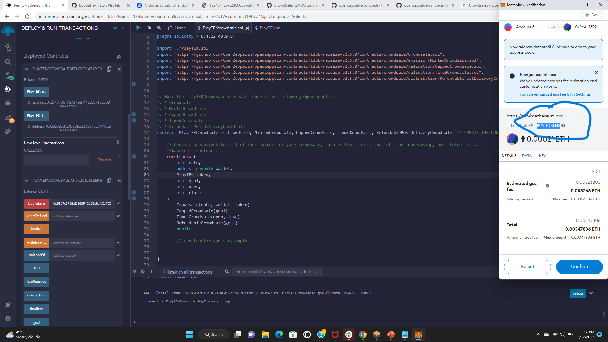
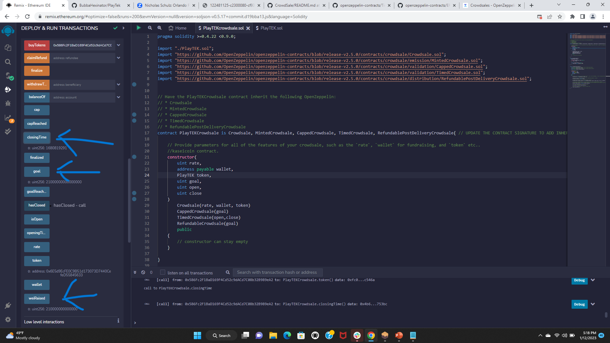

# PlayTEK

An Executable Crowdsale Contract for raising funds for anyproject

***A list of libraries and Dependcies I used to make this happen***
## Libraries and Dependencies
* [Remix IDE](https://remix.ethereum.org)
* [Ganache](https://www.trufflesuite.com/ganache)
* [MetaMask](https://metamask.io/)
* [OpenZeppelin Solidity Library](https://docs.openzeppelin.com/contracts/4.x/)

## Summary
This repo contains A decentralized Crowdsale Contract for raising funds designed to facilitate the crowdsale of a unique token for purposes of funding a new network project called PlayTEK. 

Some additional features of the contract include:
* Initial cap of 300 ETH with embedded trigger to refund any purchases when the total cap has been reached. 
* Time cap of 16 weeks

## Files
* [PlayTEK Coin Smart Contract](PlayTEK.sol)
* [PlayTEK Crowdsale Smart Contract](PlarTEKCrowdsale.sol)

## Execution
Contract Deployment

Deployment Confirmed

Bought Tokens

Tokens Confirmed

List of Parameters after deployment

